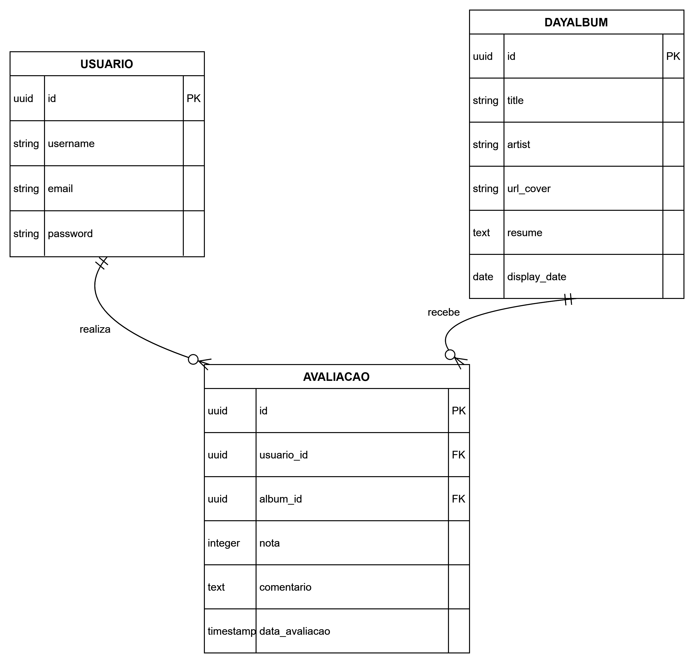

# BeShuffle

Nascido da curiosidade de explorar novos estilos musicais e descobrir artistas fora da caixa, o BeShuffle é uma aplicação que recomenda um álbum inédito a cada 24 horas. Para quem deseja ir além da audição, o projeto permite criar uma conta para avaliar e comentar sobre a indicação do dia, fomentando o debate musical.

📊 Arquitetura e Fluxo de Dados

A aplicação foi estruturada para garantir simplicidade na experiência do usuário e clareza na organização dos dados.

🔄 Fluxo principal

O sistema seleciona um álbum do dia.

O álbum é exibido para todos os usuários.

Usuários autenticados podem:

Avaliar

Comentar

As interações ficam vinculadas ao álbum e ao usuário.

Abaixo, o diagrama de entidades que ilustra como as informações se conectam dentro do projeto:

  

